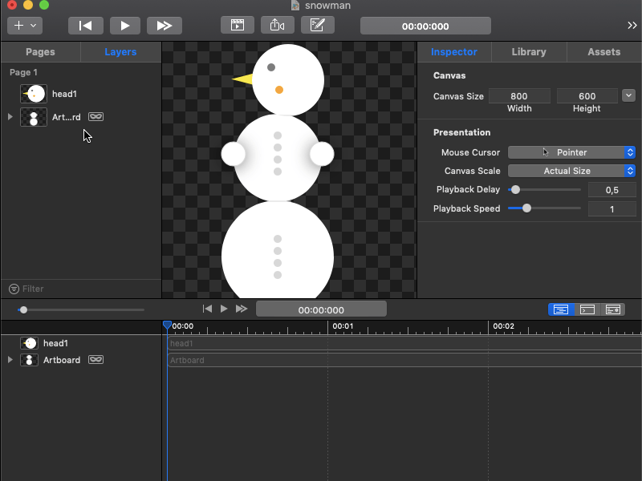

# Animating the Layer Contents property

Using the layer contents property in Core Animation, you can set an image as the content of a layer. The layer contents property is animatable and when used with keyframe animation, you can create animations such as slide show or replacement animation. 

The figure below illustrates how to create a replacement animation using the layer contents property and keyframe animation. 

