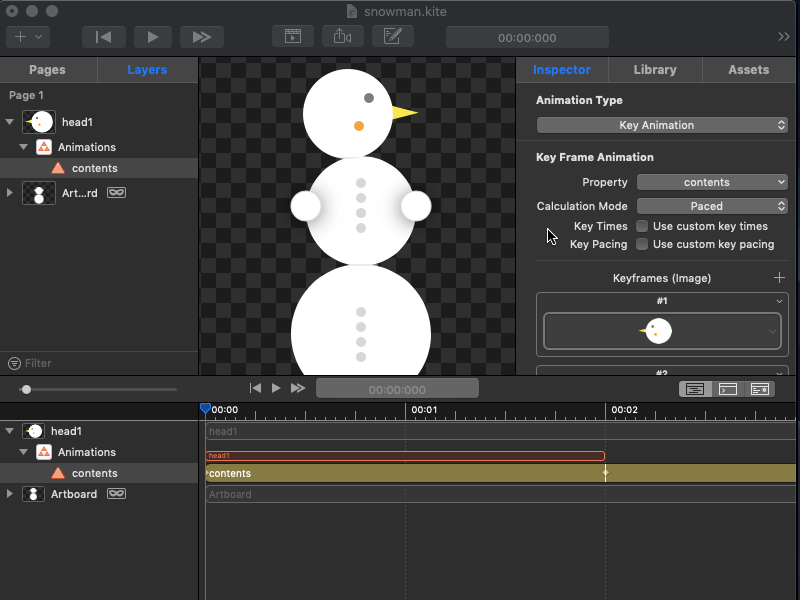
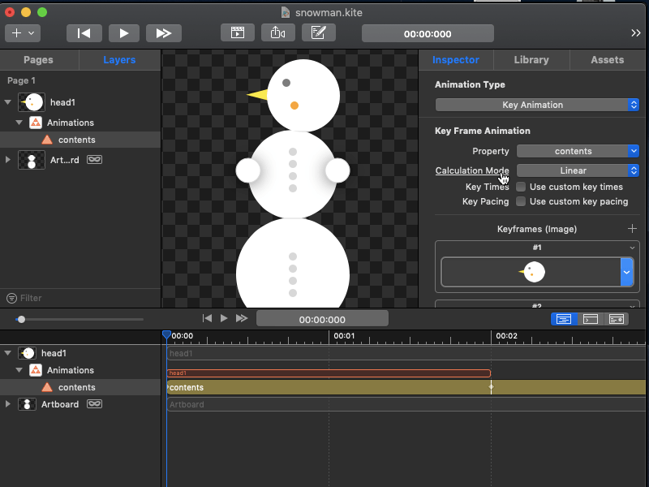
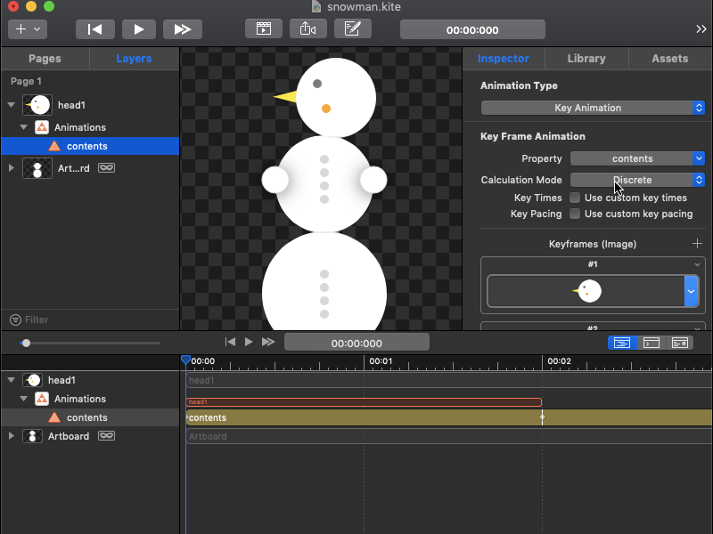

# Core Animation - Using Calculation Modes

In Core Animation, keyframes animations have option effects known as calculation modes. Calculation modes describe how to move or interpolate from one keyframe to another. There are 5 calculation modes but in this tutorial, we are going to take a look at 3 of them. 

1. Linear - keyframes are linearly interpolated as seen below. 

2. Discrete - jumps from one keyframe to another without easing or interpolation. Thus, the animation instantly changes from one image to the next rather than fading.

  
3. Cubic - uses a cubic spline to interpolate between keyframes. 

